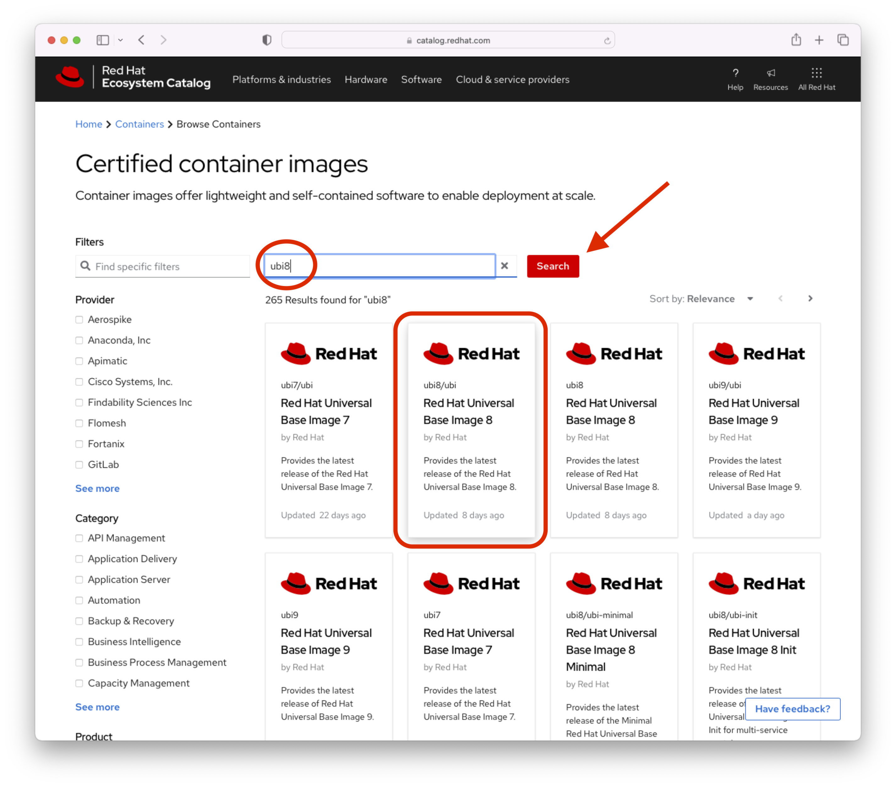

# Documentation for RHEL Developer Instance Setup

Last update: 12 April 2023

### Pre-Reqs

For this example we will be working with RHEL 8.x 

Create a VM for the developer instance and install RHEL 8.7.  The VM was sized with 2 vCPUS, 8GB RAM and 120GB "local" drive.  Note: For this example I have enabled Simple Content Access (SCA) on the Red Hat Customer portal and do not need to attach a subscription to the RHEL or Satellite repositories.  After you have created and started the RHEL 8.7 VM, we will ssh to the RHEL VM and work from the command line.

For this lab environment I chose dev01.example.com for the hostname of the server hosting Satellite. 

Check hostname and local DNS resolution.  Use dig to test forward and reverse lookup of the server hosting Satellite.  If the Satellite hostname is not available from DNS, the initial installation will fail.    
```
$ ping -c3 localhost
$ ping -c3 dev01.example.com -f
$ dig dev01.example.com +short
$ dig -x 10.1.10.254 +short
```   
We will set the hostname on the server to avoid any future issues.
```
$ hostnamectl set-hostname dev01.example.com
```

Verify the time server with chrony.  I have a local time server that my systems use for synching time.  Type the following command to check the the time synch status.  
```
$ chronyc sources -v
```
Register Satellite Server to Red Hat Subscription Management service.
```
$ sudo subscription-manager register --org=<org id> --activationkey=<activation key>
```
You can verify the registration with the following command.
```
$ sudo subscription-manager status
```    
#### Configure and enable repositories  

With SCA, we still need to enable relevant repositories for our RHEL instances.  Following steps will walk you through enabling repos.

Disable all repos.
```    
$ sudo subscription-manager repos --disable "*"
```       
Enable the following repositories.
```    
$ sudo subscription-manager repos --enable=rhel-8-for-x86_64-baseos-rpms \
--enable=rhel-8-for-x86_64-appstream-rpms
```
Verify that repositories are enabled.
```
$ sudo subscription-manager repos --list-enabled
```

Update all packages.  This may take a few minutes to complete.  Let's make sure tthe container-tools module which contains podman is up to date.
```
$ sudo dnf update
```
Install SOS package on base OS for initial systems analysis in case you need to collect problem determination for any system related issues.  
```
$ sudo dnf install sos
```
 I would also recommend registering this server to Insights.  
```
$ sudo insights-client --register
```
### Installing Podman on RHEL 8.7
Let's verify that the container-tools module is available on our RHEL instance
```
$ dnf module list | grep container-tools
container-tools      rhel8 [d][e]    common [d]                               Most recent (rolling) versions of podman, buildah, skopeo, runc, conmon, runc, conmon, CRIU, Udica, etc as well as dependencies such as container-selinux built and tested together, and updated as frequently as every 12 weeks.         
...
container-tools      4.0             common [d]                               Stable versions of podman 4.0, buildah 1.24, skopeo 1.6, runc, conmon, CRIU, Udica, etc as well as dependencies such as container-selinux built and tested together, and supported as documented on the Application Stream lifecycle page
```
Install the client-tools module which includes podman.  We chose container-tools:rhel8 to get the latest rolling updates of the container tools
```
$ sudo dnf module install -y container-tools:rhel8
```
Check the Podman version installed
```
$ podman --version
podman version 4.2.0
```
For longer Podman version information
```
$ podman version
podman version 4.2.0
[pslucas@dev01 ~]$ podman version
Client:       Podman Engine
Version:      4.2.0
API Version:  4.2.0
Go Version:   go1.18.4
Built:        Fri Jan 13 07:45:32 2023
OS/Arch:      linux/amd64
```
Use rpm -q podman for detailed release number.
```
$ rpm -q podman
podman-4.2.0-8.module+el8.7.0+17824+66a0202b.x86_64
```
If you want to update the container-tools module when a new version is released, run the dnf update command.
```
$ sudo dnf module update -y container-tools:rhel8
```

### Test our Podman Installation
We will use the latest RHEL 8.7 Universal Base Image (UBI) container for out test.

Go to the [Certified container images](https://catalog.redhat.com/software/containers/search?q=ubi&p=1) page and in the Filters text field type "ubi8" and click the red Search button.



Click on the Red Hat Universal Base Image 8 tile with the ubi8/ubi for the command to download the ubi container to your local image repository.


### Appendix
- [How do I install podman in RHEL 8 or 9?](https://access.redhat.com/solutions/3650231)
